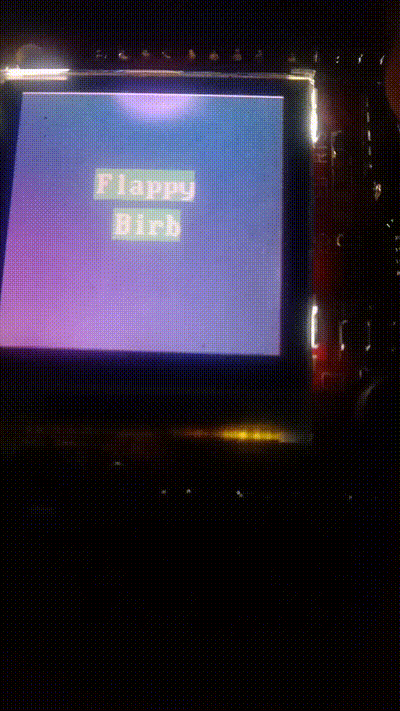
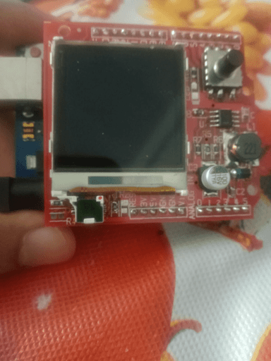

# Flappy Birb Game with SparkFun Color LCD Shield

This is a basic implementation of the Flappy Birb(Bird) game using the SparkFun Color LCD Shield for Arduino. In this game, you control a bird by jumping through gaps between obstacles to score points.

## Table of Contents

- [Prerequisites](#prerequisites)
- [Installation](#installation)
- [How to Play](#how-to-play)
- [References](#references)

## Prerequisites

Before running this game, you'll need:

- An Arduino board (tested with Arduino Uno).
- A SparkFun Color LCD Shield.
- The Arduino IDE installed on your computer.
- Necessary libraries (SparkFunColorLCDShield and Adafruit_GFX) installed in your Arduino IDE.

## Installation

1. Clone or download this repository to your local machine.
2. Open the [`flappy_birb.ino`](flappy_birb.ino) file in the Arduino IDE.
3. Make sure to select the correct Arduino board and port under the "Tools" menu.
4. Upload the code to your Arduino.

## How to Play

- Press the button on the Color LCD Shield(S3) to make the bird jump.
- Avoid obstacles and try to pass through the gaps.
- Your score increases each time you successfully pass through an obstacle.
- If you collide with an obstacle, the game is over, and your final score is displayed.

## References

- [Arduino](https://docs.arduino.cc/)
- [SparkFun Color LCD Shield library](https://www.github.com/sparkfun/ColorLCDShield/tree/master/Libraries/Arduino)

### Have fun playing your homemade Flappy Birb game on your SparkFun Color LCD Shield!